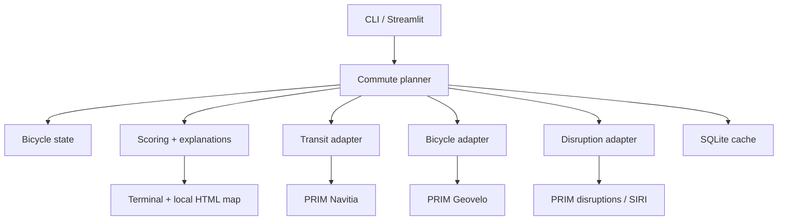

# Île-de-France bike + transit commute planner

Research report, architecture, and Codex implementation plan  
Research checked: **30 July 2026**  
Target: a local, Python-first application for a repeated home–work commute in Île-de-France

## 1. Executive recommendation

Build a small orchestration layer over two official Île-de-France Mobilités (IDFM) services:

1. **PRIM / IDFM Navitia v2** for public-transport journeys, real-time-adjusted times, stop and line identifiers, and disruptions.
2. **PRIM / Geovelo** for the bicycle leg, including route alternatives, elevation samples, vertical gain, cycling-facility types, cyclability, geometry, and a configurable cycling speed/profile.

Do **not** ask a generic multimodal endpoint to choose arbitrary bicycle sections. Model the required trip as:

```text
Outbound: home --personal bike--> chosen RER station --park bike--> transit/walk --> work
Return:   work --transit/walk--> the same RER station --retrieve bike--> home
```

The key object is therefore not merely a route. It is a **route plus bicycle state**:

```text
bike_location ∈ {home, station ID, with_user, unknown}
```

This prevents the common failure in existing planners: cycling at the wrong end, assuming the bicycle travels on the train, returning via a different station where the bicycle is not present, or proposing an excessive bicycle leg.

For v1, use a configurable shortlist of candidate RER B stations. Compute the bicycle route to each station, reject candidates beyond a hard cycling limit, request a transit journey from the exact surviving station, and rank the combined results. This is transparent, easy to test, and comfortably inside the free quotas for personal use.

Current Navitia documentation also exposes `park_mode=on_street`, which adds an explicit bike-parking section and a walk through the station access point. It is worth feature-testing this on the IDFM PRIM deployment. It may simplify the outbound request, but it does not remove the need to persist the bicycle’s station for the return journey.

### Recommended v1 stack

- Python 3.12+
- `httpx` for API calls
- `pydantic` / `pydantic-settings` for normalized models and configuration
- `typer` + `rich` for the first CLI
- SQLite from the standard library for cache, selected-route state, and optional prediction observations
- `tenacity` for bounded retries
- `pytest`, `respx`, and stored sanitized JSON fixtures
- `folium` or a small Leaflet HTML template for the map
- Plotly for the elevation profile
- `ruff`, `mypy`, and `pre-commit`

A later local UI should be **Streamlit**, keeping almost all application code in Python. The routing core must remain independent of the CLI/UI.

## 2. Requirements translated into testable behavior

| User need | Required behavior |
|---|---|
| Île-de-France only | Use IDFM coverage and reject/configure coordinates outside an Île-de-France bounding polygon. |
| Up-to-date, reliable traffic | Request Navitia journeys with `data_freshness=realtime`; show whether each section is realtime, estimated, or schedule-only; optionally validate critical departures with PRIM Stop Monitoring. |
| Planned works and interruptions | Fetch IDFM disruptions, retain active periods and affected line/stop IDs, match them to route sections, and present the affected segment and source text. |
| Feasible alternatives | Recompute routes from alternative entry stations and, for a severe affected line, request a variant avoiding the affected line/stop when possible. Never call a route “feasible” if it strands the bicycle unless clearly marked. |
| Bike only to the RER on the outbound | Force the bicycle endpoint to an exact candidate station. Transit starts at that station. The final leg is transit/walk only. |
| Bike only after the RER on return | Transit ends at the persisted bicycle station. Cycling starts there and ends at home. |
| Configurable bicycle duration | Use both a preferred threshold and a hard maximum, rather than a binary five-minute assumption. |
| “20 min preferred; 22 min can work; an hour cannot” | Suggested defaults: `preferred_bike_minutes: 20`, `max_bike_minutes: 25`. The user can set `max_bike_minutes: 22` for a strict day. Apply a smooth penalty above 20 and reject above the hard limit. |
| Altitude profile | Request Geovelo with elevations and plot distance versus elevation; report total ascent. |
| Bike-lane availability | Decode Geovelo instructions/facility and distance fields; report protected/recommended/ordinary/discouraged distance and percentage. |
| Bicycle alternatives | Ask Geovelo for multiple results and label `RECOMMENDED`, `SAFER`, `FASTER`, or `BIS`. At minimum retain the fastest valid route. |

## 3. Existing applications: what is already available

### 3.1 Closest consumer solutions

| Product | Strengths | Why it does not fully solve this use case |
|---|---|---|
| **Citymapper** | Markets genuinely multimodal journeys combining personal cycling and public transport, with real-time data and cycle navigation. It is the closest ready-made app. | The station-selection logic, bicycle-duration cutoff, return-to-the-same-bike constraint, ranking formula, realtime provenance, and detailed elevation/facility output are not exposed as programmable controls. A current self-service public routing API could not be confirmed; the current offering is oriented toward cities/enterprise. |
| **Île-de-France Mobilités app** | Official regional source; real-time routes, next departures, traffic information, avoidance controls, and Geovelo integration. | It exposes bicycle and transit routing but not the exact persistent-bike workflow and custom scoring required here. |
| **Bonjour RATP** | Strong RATP journey, traffic, and walking/bicycle guidance in Paris/Île-de-France. | Less appropriate as the primary programmable source for a route crossing RATP, RER, and outer bus operators; RATP directs dynamic-data consumers toward regional arrangements and PRIM is the regional authority source. |
| **Geovelo** | Best dedicated bicycle planning option in this survey: fast/safe/balanced routes, bicycle profiles, cycling facilities, and navigation. | Bicycle only; it does not own the full transit and parked-bike state machine. Its PRIM API is nevertheless ideal as a component of this app. |
| **Google Maps** | Broad routing and familiar maps. The Routes API supports one travel mode per route request, including transit or cycling. | A custom multi-request join would still be necessary; billing is required, detailed regional disruption semantics and cycling-facility transparency are weaker for this task, and it is not a free-first choice. |

Useful references:

- [IDFM application](https://www.iledefrance-mobilites.fr/en/application)
- [IDFM app features](https://play.google.com/store/apps/details?id=com.applidium.vianavigo)
- [Citymapper cycle routing](https://citymapper.com/news/2523/our-global-cycle-routing)
- [Citymapper for Cities](https://docs.external.citymapper.com/)
- [Bonjour RATP](https://www.bonjour-ratp.fr/)
- [Geovelo](https://geovelo.app/en/)
- [Google Routes API overview](https://developers.google.com/maps/documentation/routes/compute-route-over)

### 3.2 Conclusion from the product comparison

Citymapper should be kept as a **human benchmark**, not used as an undocumented backend. On several representative mornings, compare its proposed arrival time and route with this application. The implementation should rely on documented official/open APIs whose behavior and identifiers can be tested.

## 4. Data and API survey

### 4.1 Recommended authoritative sources

| Need | Source | Access and quota noted on 30 July 2026 | Suitability |
|---|---|---|---|
| Transit journey planning | **IDFM PRIM – Calculateur / Navitia generic access v2** | Account and token required. PRIM lists a default free quota of 1,000 requests/day; increased free quota may be requested. | Primary v1 source. Regional, cross-operator, supports realtime journey calculation and structured sections. |
| Realtime/planned disruptions | **IDFM PRIM – Messages Info Trafic**, either Navitia line reports or global disruptions | Account/token. Default global disruptions quota listed as 1,000/day; generic Navitia traffic API has a larger listed default allocation. | Primary alert source. Includes incidents, planned and unplanned works, associated lines and stops. |
| Critical next departures | **IDFM PRIM – Prochains passages / Stop Monitoring** | Account/token. Default 1,000/day for new/default use. SIRI Lite; coverage is still explicitly partial. | Optional confirmation layer, especially final bus and chosen RER boarding. Do not assume every stop is realtime-covered. |
| Bicycle routing | **IDFM PRIM – Geovelo** | Account/token. Default free quota listed as 1,000/day, with an increased free quota up to 5,000/day. | Primary bicycle source. Three route choices, bike type/profile, geometry, elevation and cycling-facility detail. |
| Scheduled network data | **IDFM GTFS Datahub** | Login required on PRIM. Covers the next 30 days and is updated at 08:00, 13:00 and 17:00. | Useful for local stop discovery, validation, and a future self-hosted router; not necessary for first v1. |
| Realtime coverage inventory | **IDFM realtime perimeter dataset** | PRIM dataset, updated weekly. | Use to label where Stop Monitoring validation is and is not available. |
| Bicycle parking | Navitia `places_nearby`, IDFM/OSM-derived data, or the **Base Nationale du Stationnement Cyclable** | Open dataset; OSM/ODbL attribution. | Optional but useful for checking racks/secure parking near candidate stations. Absence of a record must be “unknown,” not “no parking.” |
| Cycling infrastructure independent check | **Base Nationale des Aménagements Cyclables** | Open national OSM/Geovelo-derived dataset, available as Parquet. | Optional analytics/QA. Geovelo already returns route-level facility information. |

Official references:

- [PRIM API catalogue](https://prim.iledefrance-mobilites.fr/fr/catalogue-data)
- [PRIM API quotas](https://prim.iledefrance-mobilites.fr/fr/notre-offre)
- [IDFM Navitia generic API](https://prim.iledefrance-mobilites.fr/fr/apis/idfm-navitia-general-v2)
- [IDFM global disruptions API](https://prim.iledefrance-mobilites.fr/fr/apis/idfm-disruptions_bulk)
- [IDFM Stop Monitoring API](https://prim.iledefrance-mobilites.fr/fr/apis/idfm-ivtr-requete_unitaire)
- [IDFM realtime coverage perimeter](https://prim.iledefrance-mobilites.fr/fr/jeux-de-donnees/perimetre-des-donnees-tr-disponibles-plateforme-idfm)
- [IDFM Geovelo API](https://prim.iledefrance-mobilites.fr/fr/apis/idfm-geovelo)
- [Geovelo technical API PDF](https://eu.ftp.opendatasoft.com/stif/Doc_API/Geovelo/Documentation-Technique-de-l-API-geovelo.pdf)
- [IDFM scheduled GTFS](https://prim.iledefrance-mobilites.fr/fr/jeux-de-donnees/offre-horaires-tc-gtfs-idfm)
- [National bicycle parking data](https://transport.data.gouv.fr/datasets/stationnements-cyclables-issus-dopenstreetmap)
- [National cycling-facility data](https://transport.data.gouv.fr/datasets/amenagements-cyclables-france-metropolitaine)

### 4.2 Navitia capabilities relevant to this app

The generic Navitia journey endpoint supports:

- `first_section_mode[]` and `last_section_mode[]`
- `max_duration_to_pt` in seconds
- `direct_path=none` to require public transport
- `data_freshness=realtime`
- `forbidden_uris[]` to avoid a line, mode, network, or other object
- separate base and realtime timestamps
- disruptions linked to affected journey sections
- `park_mode=on_street`, which adds a park section and then a walk through the station access point
- Valhalla-derived bicycle/walking costing options in current Navitia documentation

Important limitation: `max_duration_to_pt` is documented as the same cap before and after transit. It is not a complete expression of “bike only at this end and retrieve the same bike tonight.” Therefore, explicit orchestration remains the reference design.

References:

- [Navitia journey modes and API documentation](https://doc.navitia.io/)
- [`max_duration_to_pt`](https://doc.navitia.io/#journeys)
- [Navitia realtime behavior](https://doc.navitia.io/#realtime)

### 4.3 Geovelo response fields that directly satisfy the bicycle requirements

The PRIM Geovelo documentation describes:

- alternatives titled `RECOMMENDED`, `SAFER`, `FASTER`, and `BIS`
- query flags for `elevations`, `geometry`, and `instructions`
- traditional, shared, electric, cargo, VTC, beginner/median/expert profiles
- configurable average speed between 5 and 45 km/h
- duration and encoded geometry
- `verticalGain`
- elevation tuples containing distance from start, elevation, and geometry index
- facility classifications such as `CYCLEWAY`, `LANE`, `GREENWAY`, `SHAREBUSWAY`, `ZONE30`, `RESIDENTIAL`, and `NONE`
- a cyclability rating from 1 to 5
- distance aggregates including normal, recommended, and discouraged roads

This is a stronger fit than combining a generic bicycle route with a separate elevation API.

### 4.4 Free/open alternatives for the bicycle component

| Option | Hosted free use | Self-hostable | Elevation | Cycling detail / alternatives | Recommendation |
|---|---:|---:|---:|---|---|
| **PRIM Geovelo** | Yes, token/quota | Not the chosen self-host path | Yes | Excellent for this exact region and requirement | Default |
| **openrouteservice / HeiGIT** | Free standard plan with account and limits | Yes | Yes | Cycling profiles, extras and up to three alternatives; current endpoint/quota details should be read from the live account page | Best hosted fallback |
| **Valhalla** | Community instances exist but should not be treated as an SLA | Yes | Yes, including `/height` profile sampling | Highly configurable bicycle costing; surface/hill/road preferences and alternatives | Best self-hosted bicycle engine |
| **GraphHopper** | Commercial hosted free allowance may change | Core is self-hostable | Yes | Bicycle profiles and path details; some advanced features are commercial | Good, but less compelling than Valhalla here |
| **BRouter** | Public demo/server use is not a production guarantee | Yes | Typically GPX elevation/profile support | Excellent customizable bicycle profiles and alternatives | Strong enthusiast/offline fallback |
| **OSRM** | Public demo not for application traffic | Yes | No built-in elevation | Bicycle quality depends on custom profile and facility detail is limited | Not recommended for this app |

Relevant primary documentation:

- [openrouteservice API restrictions](https://openrouteservice.org/restrictions/)
- [Valhalla route API and bicycle costing](https://valhalla.github.io/valhalla/api/route/api-reference/)
- [Valhalla elevation API](https://valhalla.github.io/valhalla/api/elevation/)
- [GraphHopper routing API](https://docs.graphhopper.com/openapi/routing)

### 4.5 Self-hosting the full transit stack

**OpenTripPlanner (OTP)** is the most relevant future self-hosted option. It explicitly supports `BICYCLE_PARK`: ride a bicycle to a departure station, leave it there, and continue by transit/walking. It consumes GTFS and GTFS-Realtime trip updates/alerts.

However, this is not the recommended v1 because:

- the IDFM scheduled GTFS must be refreshed several times per day;
- IDFM realtime is exposed primarily through PRIM/Navitia and SIRI services, not as a single guaranteed regional GTFS-RT bundle ready for OTP;
- SIRI-to-GTFS-RT normalization, stable identifier matching, updater operation, graph builds, and monitoring add substantial work;
- the official IDFM calculator already integrates the regional data and operator-specific corrections.

OTP becomes attractive only if PRIM quotas or control become limiting, or if offline/research-grade routing is a goal.

References:

- [OTP routing modes, including bicycle parking](https://docs.opentripplanner.org/en/latest/RoutingModes/)
- [OTP GTFS-RT configuration](https://docs.opentripplanner.org/en/latest/GTFS-RT-Config/)
- [OTP bike-parking filtering](https://docs.opentripplanner.org/en/v2.4.0/RouteRequest/)

**MOTIS/Transitous** is another open-source/public experiment, but its regional data completeness and realtime behavior should not replace IDFM’s authoritative services for a daily commute.

## 5. Proposed system behavior

### 5.1 Planning modes

The application should expose four commands:

```text
plan outbound --depart-at TIME
plan outbound --arrive-by TIME
plan return   --depart-at TIME
plan round-trip --arrive-work-by TIME --leave-work-at TIME
```

The round-trip planner is important because it can select the station using both morning and evening costs. A route that saves two minutes in the morning but adds fifteen minutes and a poor bicycle route in the evening should not automatically win.

### 5.2 Candidate station generation

Start with explicit configured station IDs, not an unrestricted region-wide search:

```yaml
candidate_stations:
  - id: "stop_area:..."
    label: "Candidate RER B station A"
    lines: ["RER B"]
  - id: "stop_area:..."
    label: "Candidate RER B station B"
    lines: ["RER B"]
```

This is reliable for a repeated commute and avoids spending API calls on clearly irrelevant stops. Add automatic discovery later:

1. Query/cache all stop areas on RER B.
2. Apply a cheap straight-line radius derived from `max_bike_minutes × assumed_speed`.
3. Ask Geovelo only about surviving stations.
4. Retain only stations that yield a valid journey to work.

### 5.3 Outbound algorithm

For departure time \(t_0\):

1. Load current bicycle location.
2. If the bicycle is not at home, do not propose a normal home-bike departure without a warning/recovery action.
3. Fetch active and upcoming disruptions once and cache briefly.
4. For each candidate station \(s\):
   1. Get cached or fresh Geovelo alternatives \(B(home,s)\).
   2. Reject bicycle routes over `max_bike_minutes`.
   3. Let \(d_b\) be bicycle duration and \(d_p\) the station parking/entry buffer.
   4. Request a realtime Navitia journey \(T(s,work,t_0+d_b+d_p)\) from the exact stop area.
   5. Match route sections to active disruption objects.
   6. Optionally validate the first critical departure with Stop Monitoring.
   7. Build a normalized combined candidate.
5. Also request a baseline all-transit home-to-work route.
6. Generate avoidance variants when the primary candidate intersects a material disruption.
7. Rank, explain, and show the best 3–5 materially different candidates.
8. Only after the user chooses/confirms a route, persist `bike_location=station_id` with a timestamp and source journey ID.

For `--arrive-by`, reverse the temporal calculation:

1. Ask Navitia for a journey from exact station \(s\) to work arriving by the target.
2. Compute the required home departure as:

\[
t_{\mathrm{leave,home}} =
t_{\mathrm{depart,station}} - d_b - d_p
\]

3. Reject if the returned transit itinerary leaves insufficient time for the bicycle/parking leg.

### 5.4 Return algorithm

1. Read `bike_location`.
2. If it is a station, force the transit destination to that exact station.
3. Request work-to-station transit in realtime.
4. Append the cached/refreshed station-to-home Geovelo route.
5. Offer alternatives in three classes:
   - **retrieves bike today** — always preferred;
   - **retrieves bike with a detour** — e.g. alternate transit to a nearby station plus walk/transit to the stored bike;
   - **leaves bike behind** — allowed only as an explicitly labelled emergency option.
6. When the selected return is completed/confirmed, set `bike_location=home`.

If state is unknown, ask for a one-time explicit choice in an interactive UI or accept `--bike-at home|STATION_ID`.

### 5.5 Round-trip algorithm

For each station \(s\), compute:

\[
C_{\mathrm{day}}(s) =
C_{\mathrm{outbound}}(s)
+ C_{\mathrm{return}}(s)
+ P_{\mathrm{risk}}(s)
\]

Rank stations by the whole day, while still showing morning arrival and evening home arrival independently.

### 5.6 Navitia one-call feature probe

During milestone 1, test whether the PRIM deployment accepts and correctly applies:

```text
first_section_mode[]=bike
last_section_mode[]=walking
park_mode=on_street
direct_path=none
max_duration_to_pt=1320
data_freshness=realtime
```

Acceptance checks:

- the journey contains a bicycle section only before public transport;
- it contains a `park` section;
- it does not contain bicycle after public transport;
- the parked station and access point are explicit;
- the bike duration respects the cap;
- route times and disruptions are realtime-labelled.

Even if this works, retain the explicit two-stage implementation as a fallback and use Geovelo for the richer bicycle report.

## 6. Ranking and “realistic time”

### 6.1 Do not invent a precision the data cannot support

V1 should distinguish:

- **published realtime ETA** — supplied by Navitia/SIRI;
- **scheduled ETA** — no realtime estimate available;
- **robust arrival** — app-computed safety view including connection risk/buffers;
- **data age** — how old the underlying response is.

Do not add a second generic “traffic correction” to a Navitia realtime time; that would double count. Instead, add explicit operational buffers and uncertainty labels.

### 6.2 Suggested scoring model

For a candidate \(j\):

\[
\begin{aligned}
C(j) ={}&
t_{\mathrm{door-to-door}}
+ w_b P_b(t_{\mathrm{bike}})
+ w_x N_{\mathrm{transfers}} \\
&+ w_m P_{\mathrm{margin}}
+ w_d P_{\mathrm{disruption}}
+ w_f P_{\mathrm{freshness}}
+ w_c P_{\mathrm{cycling\ comfort}}
\end{aligned}
\]

Suggested interpretable terms:

```python
def bike_penalty(minutes: float, preferred: float, hard: float) -> float:
    if minutes > hard:
        return math.inf
    if minutes <= preferred:
        return 0.0
    # Softly penalize 20–25 min instead of treating 20:01 as impossible.
    return 0.7 * (minutes - preferred) ** 2
```

- Reject below-minimum transfer margins, unless Navitia explicitly models a guaranteed transfer.
- Penalize a transfer with less than a configurable buffer.
- Penalize a route section affected by a severe/unknown alert more than one affected only by informational works outside the journey time.
- Penalize schedule-only critical buses more than fresh realtime departures.
- Treat cycling comfort as a preference, not an unbounded override of travel time.

Store the component scores and print them. A user must be able to see why option 1 beat option 2.

### 6.3 Reliability confidence

Assign a confidence label per candidate:

- **High**: all critical departures realtime, feed fresh, no material alert, adequate margins.
- **Medium**: at least one scheduled-only section or tight but valid transfer.
- **Low**: stale/missing realtime, unresolved material disruption, or an alternative based on uncertain affected scope.

The label must be rule-based and testable in v1.

### 6.4 Later empirical calibration

After v1 is stable, optionally store local snapshots:

- prediction timestamp;
- predicted departure/arrival;
- later observed departure/arrival;
- line, stop, direction, weekday, and time band;
- disruption state.

Estimate local residual distributions and display p50/p90 arrival intervals. Before retaining raw API data long-term, re-check the current PRIM CGU and Licence Mobilité storage/reuse conditions. This is a phase-3 feature, not required for useful v1 behavior.

## 7. Disruption interpretation and alternatives

Normalize every disruption into:

```python
class Disruption:
    id: str
    title: str
    message: str
    cause: str | None
    severity: str | None
    effect: str | None
    planned: bool | None
    application_periods: list[TimeInterval]
    affected_line_ids: set[str]
    affected_stop_area_ids: set[str]
    affected_stop_point_ids: set[str]
    affected_segment: tuple[str, str] | None
    updated_at: datetime | None
    source: str
```

For each displayed journey:

1. Match by stable IDs, not labels such as “B” or “21”.
2. Intersect the disruption application interval with the journey interval.
3. If stop-level scope is available, intersect it with the stops traversed by that section.
4. Present:
   - what happened;
   - planned versus unplanned where known;
   - active period;
   - affected line;
   - affected stops/segment, or “segment not specified by source”;
   - which section of this candidate is affected;
   - whether the realtime journey engine has already changed the itinerary.

Alternative generation:

- first, let `data_freshness=realtime` return naturally modified journeys;
- next, try other bicycle-entry stations;
- if still affected, request a variant with the severe affected `line` or `stop_area` in `forbidden_uris[]`;
- retain a baseline all-transit route;
- deduplicate alternatives by ordered sequence of `(mode, line_id, boarding_stop, alighting_stop)`.

Never infer that a route is unaffected merely because the alert text is absent from one section. Report “no matched alert in the current source response,” not an absolute guarantee.

## 8. Bicycle route presentation

For each bicycle alternative show:

- duration and distance;
- ascent and elevation plot;
- preferred/hard threshold status;
- route type (`FASTER`, `SAFER`, etc.);
- protected/recommended/ordinary/discouraged distance and percentage;
- facility breakdown;
- cyclability summary;
- a map with the route colored by facility or comfort where response geometry indexing permits it;
- nearby bicycle parking and its metadata, when available.

Suggested facility grouping:

```yaml
protected:
  - CYCLEWAY
  - GREENWAY
moderately_protected:
  - LANE
  - SHAREBUSWAY
calmed:
  - ZONE30
  - LIVINGSTREET
  - RESIDENTIAL
unprotected_or_unknown:
  - NONE
  - PRIMARY
  - SECONDARY
  - TERTIARY
```

Do not silently equate `recommendedRoads` with protected bike lanes. Preserve Geovelo’s original fields and label the app’s grouping as an interpretation.

## 9. Architecture



### 9.1 Provider boundaries

Define protocols so APIs can be replaced without changing planning logic:

```python
class TransitRouter(Protocol):
    async def journeys(self, request: TransitRequest) -> list[TransitJourney]: ...

class BikeRouter(Protocol):
    async def routes(self, request: BikeRequest) -> list[BikeRoute]: ...

class DisruptionProvider(Protocol):
    async def disruptions(self, interval: TimeInterval) -> list[Disruption]: ...

class DepartureProvider(Protocol):
    async def departures(self, stop_id: str, line_id: str | None) -> list[Departure]: ...
```

### 9.2 Normalized domain models

Do not let raw Navitia, SIRI, or Geovelo dictionaries escape provider modules.

Core models:

- `Location`
- `Station` with stable source IDs and access-point coordinates
- `BikeRoute` and `BikeFacilitySegment`
- `TransitJourney`, `TransitLeg`, and `Transfer`
- `Disruption`
- `CombinedJourney`
- `ScoreBreakdown`
- `Freshness`
- `BikeState`
- `PlanningRequest`

Every model carrying time must use timezone-aware datetimes in `Europe/Paris`; serialize as ISO 8601 with offsets.

### 9.3 Proposed repository structure

```text
idf-commute-planner/
├── README.md
├── pyproject.toml
├── .env.example
├── config.example.yaml
├── src/
│   └── idf_commute/
│       ├── __init__.py
│       ├── cli.py
│       ├── config.py
│       ├── domain/
│       │   ├── models.py
│       │   ├── scoring.py
│       │   └── state.py
│       ├── planning/
│       │   ├── planner.py
│       │   ├── candidates.py
│       │   ├── disruptions.py
│       │   └── deduplicate.py
│       ├── providers/
│       │   ├── prim_client.py
│       │   ├── navitia.py
│       │   ├── geovelo.py
│       │   ├── siri.py
│       │   ├── parking.py
│       │   └── protocols.py
│       ├── persistence/
│       │   ├── cache.py
│       │   └── bike_state.py
│       └── presentation/
│           ├── terminal.py
│           ├── map.py
│           └── elevation.py
├── tests/
│   ├── fixtures/
│   │   ├── navitia/
│   │   ├── geovelo/
│   │   ├── disruptions/
│   │   └── siri/
│   ├── unit/
│   ├── contract/
│   └── integration/
└── scripts/
    └── capture_sanitized_fixture.py
```

### 9.4 Configuration

```yaml
timezone: Europe/Paris

locations:
  home:
    latitude: 0.0
    longitude: 0.0
  work:
    latitude: 0.0
    longitude: 0.0

bicycle:
  profile: MEDIAN
  bike_type: TRADITIONAL
  electric: false
  average_speed_kmh: 16
  preferred_bike_minutes: 20
  max_bike_minutes: 25
  parking_buffer_minutes: 4
  route_preference: RECOMMENDED

transit:
  coverage: idfm
  data_freshness: realtime
  minimum_transfer_minutes: 5
  validate_critical_departures: true
  preferred_lines: []
  forbidden_lines: []

candidate_stations:
  - id: "REPLACE_WITH_NAVITIA_STOP_AREA_ID"
    label: "RER B candidate"

state:
  sqlite_path: "./data/commute.sqlite3"

cache:
  bicycle_ttl_hours: 24
  station_ttl_days: 7
  journey_ttl_seconds: 45
  disruption_ttl_seconds: 120
  departure_ttl_seconds: 30
```

Secrets belong in environment variables:

```dotenv
PRIM_API_KEY=
```

The exact PRIM header and endpoint paths must be taken from the user’s authenticated API playground during the first spike. Never commit the token or print it in logs.

## 10. API efficiency and resilience

For a personal commute with 3–6 candidate stations, the default 1,000 calls/day is sufficient if caching and concurrency are sensible.

Example outbound run:

- 1 disruption request;
- 0–6 Geovelo requests (normally cached);
- 3–6 Navitia journey requests;
- 0–3 critical Stop Monitoring requests;
- 1 baseline transit request.

Implementation rules:

- use a single `httpx.AsyncClient`;
- bound concurrency with a semaphore, initially 4;
- retry only connection errors, 429, and transient 5xx, with jitter and a strict maximum;
- honor `Retry-After`;
- no unbounded retries;
- cache raw responses for debugging and normalized results for planning;
- stale-while-error is acceptable for bicycle geometry and static station metadata;
- stale transit/disruption data must be visibly labelled and must not silently masquerade as realtime;
- record provider status, response timestamp, latency, and remaining quota headers if exposed;
- define a request budget per planning run.

## 11. Test strategy

### 11.1 Unit tests

- soft bicycle penalty is zero at/below 20 min, finite at 22 min, and infinite above the hard maximum;
- outbound never contains bicycle after the first transit boarding;
- return never selects a different bicycle station without an explicit “leaves bike behind” classification;
- alert active-period and affected-stop matching;
- schedule versus realtime timestamp normalization;
- stale-data confidence downgrade;
- deduplication of materially identical journeys;
- DST transitions in `Europe/Paris`;
- arrive-by temporal subtraction;
- round-trip score consistency.

### 11.2 Provider contract tests

Using sanitized recorded fixtures:

- Navitia base schedule;
- delayed realtime section;
- cancelled/no-service journey;
- modified service and skipped stop;
- planned works spanning only part of a line;
- Geovelo multiple alternatives with elevation/facility data;
- SIRI Stop Monitoring with estimated and schedule-only calls;
- partial/missing fields;
- 401, 403, 429, 500, timeout, malformed response.

### 11.3 Live integration checks

Opt-in tests requiring `PRIM_API_KEY`:

- `/places` resolves each configured station;
- a known RER B journey returns;
- `data_freshness=realtime` is accepted;
- disruption endpoint returns a parseable response;
- Geovelo returns geometry and elevation;
- the `park_mode=on_street` feature probe;
- known bus lines 4602/21/22 resolve to stable IDs;
- realtime perimeter identifies which relevant stops support Stop Monitoring.

Do not put live API tests in the default fast test suite.

### 11.4 Scenario acceptance tests

1. **Normal morning:** best bike-to-RER candidate plus baseline all-transit, with exact required leave time.
2. **Bike threshold:** 19-, 22-, and 60-minute routes; 22 remains eligible with a penalty, 60 is rejected.
3. **RER B works:** show the source message, affected segment, and at least one alternative if the provider can produce one.
4. **M12/M4 disruption:** bicycle-to-RER option should naturally become more competitive.
5. **Final bus delay/cancellation:** update ETA/confidence and show another feasible bus/walk/transit option.
6. **Return trip:** use the same station selected in the morning.
7. **Emergency return:** if the bike station is inaccessible, distinguish retrieval, detour, and leave-behind options.
8. **Realtime unavailable:** produce a schedule-based result clearly labelled as such, not a failure or fake realtime.

## 12. Development plan for Codex

### Milestone 0 — account setup and route facts

Human actions:

1. Create/sign in to a PRIM account.
2. Subscribe to:
   - Navitia generic access v2;
   - traffic/disruptions;
   - Geovelo;
   - Stop Monitoring if desired.
3. Generate a token and store it as `PRIM_API_KEY`.
4. Fill home/work coordinates locally.
5. Identify an initial candidate-station shortlist.

Codex actions:

- scaffold the repository and quality tooling;
- add `.env.example`, config schema, and secret-safe logging;
- create `scripts/capture_sanitized_fixture.py`;
- document authenticated playground steps without embedding a token.

Exit criterion: configuration loads, secrets are absent from Git status/output, tests run.

### Milestone 1 — API discovery spike

Codex should implement a disposable-but-committed `probe` CLI that:

- resolves station/line IDs, including RER B and buses 4602/21/22;
- captures one Navitia journey response;
- captures disruptions;
- captures Geovelo alternatives with geometry/elevation/instructions;
- checks Stop Monitoring coverage for relevant stops;
- tests Navitia `park_mode=on_street`;
- saves redacted fixtures.

Do not build the complete UI before this. PRIM endpoints require authentication, and actual field/identifier behavior must be observed.

Exit criterion: all required payloads are represented by fixtures and a short `docs/api-findings.md` records supported/unsupported parameters.

### Milestone 2 — normalized provider adapters

Implement:

- shared PRIM client with authentication, timeout, retry, error mapping, metrics, and cache hooks;
- Navitia adapter;
- Geovelo adapter including HPack-like instruction decoding where required by the response;
- disruption adapter;
- optional SIRI Stop Monitoring adapter;
- Pydantic domain models.

Exit criterion: adapters pass fixture contract tests and no raw provider dictionaries leave `providers/`.

### Milestone 3 — outbound planner

Implement explicit station-join orchestration:

- candidate filtering;
- bicycle alternatives;
- depart-at and arrive-by;
- baseline all-transit;
- combined timeline;
- threshold enforcement;
- score breakdown;
- disruption matching;
- terminal output.

Exit criterion: normal, threshold, and disruption scenario tests pass.

### Milestone 4 — bicycle state and return/round-trip planner

Implement:

- SQLite bicycle state;
- route selection confirmation;
- forced return to stored station;
- round-trip ranking;
- recovery modes for unknown/stranded bicycle.

Exit criterion: no generated return candidate silently assumes the bicycle exists at another station.

### Milestone 5 — reliability layer

Implement:

- data freshness and age;
- critical Stop Monitoring validation;
- connection-margin checks;
- robust arrival/confidence;
- avoidance variants using `forbidden_uris[]`;
- request budget and graceful stale-data behavior.

Exit criterion: every displayed time says whether it is realtime or scheduled and every low-confidence result explains why.

### Milestone 6 — local visual report

Implement:

- local HTML map;
- bicycle alternatives;
- facility-colored route where possible;
- elevation profile;
- alert panels;
- option comparison;
- terminal link to the generated file.

Exit criterion: one command prints a useful summary and opens/produces a self-contained route report.

### Milestone 7 — Streamlit UI

Only after the core is tested:

- direction and depart/arrive controls;
- preferred/hard cycling sliders;
- route cards;
- station and bike-state selector;
- map/elevation view;
- refresh button with data-age display;
- route selection/confirmation.

Exit criterion: all planning remains in the core package; Streamlit contains presentation glue only.

### Milestone 8 — optional history and self-hosting

Possible later work:

- personal delay residuals and p50/p90 calibration;
- notifications before routine departure;
- weather and rain preference;
- bicycle parking quality/security metadata;
- automatic station discovery;
- OTP + IDFM GTFS prototype;
- Valhalla self-hosting for offline/unlimited bicycle routing.

None is required for v1.

## 13. Definition of done for v1

The first useful release is done when:

- a local command plans outbound and return journeys;
- bike use is restricted to home↔the selected RER station;
- return retrieves the same bicycle;
- 20 minutes is a soft preference and the hard maximum is user-configurable;
- 60-minute bicycle options cannot appear when the hard cap is much lower;
- at least one all-transit baseline is shown;
- official realtime/schedule provenance is visible;
- relevant works/incidents show what, where, and when;
- materially affected routes receive alternatives or an honest “no feasible alternative found”;
- Geovelo distance, ascent, elevation, and cycling-facility information are displayed;
- API failures degrade explicitly rather than producing confident stale results;
- tokens and precise home/work coordinates are not committed;
- fixture-based tests pass without network access.

## 14. Risks and decisions to preserve

| Risk | Mitigation / decision |
|---|---|
| PRIM authentication prevents anonymous research calls | Milestone 1 uses the user’s token and records sanitized fixtures. Keep endpoint details configurable. |
| Default 1,000/day quotas | Cache bicycle/static data, cache alerts briefly, limit candidates, and display/request-budget metrics. Personal use should fit. |
| Stop Monitoring covers only part of the network | Use it as validation, not as the sole journey source; label schedule-only sections. |
| Alert scope may be vague | Preserve source text and say when the affected segment is unspecified. |
| Bus stop-point IDs may change with GTFS updates | Prefer stable stop-area/line IDs where possible; refresh discovery mappings and test relevant routes. |
| A stateless planner forgets where the bicycle is | Persist bike location and require selection confirmation. |
| A one-call multimodal route may use the bicycle incorrectly | Validate mode order and retain the explicit station-join algorithm. |
| Cycling facility data can be incomplete | Preserve unknown categories and OSM/Geovelo attribution; do not convert unknown to unsafe/no facility. |
| “Realtime” is not a guarantee | Display data age, source, coverage, connection margin, and confidence. |
| Long-term API response storage may have licence constraints | Cache minimally in v1 and review current CGU/Licence Mobilité before historical collection or distribution. |
| Public map/routing demo servers have no application SLA | Use PRIM or a registered hosted service; self-host before depending on a community demo. |

## 15. First prompt for the next Codex session

Use the following as the implementation handoff:

> Read `ile-de-france-commute-planner-report.md` completely. Implement Milestone 0 and Milestone 1 only. Build a Python 3.12+ package named `idf-commute-planner` using `httpx`, Pydantic settings, Typer, Rich, pytest, respx, Ruff, and mypy. Do not implement the final planner or UI yet. Add a safe `probe` CLI for the authenticated PRIM Navitia, disruptions, Geovelo, and optional Stop Monitoring APIs; resolve the configured RER B and bus line identifiers; feature-test Navitia `park_mode=on_street`; redact tokens and precise home/work coordinates from logs and fixtures; save representative sanitized fixtures; and write `docs/api-findings.md` with observed endpoint paths, headers, supported parameters, response timestamps, realtime coverage, and any deviations from the report. Stop and report clearly if PRIM access or required subscriptions are missing. Run all offline tests and show the exact next implementation step.

